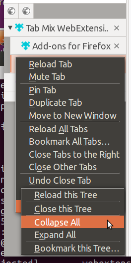
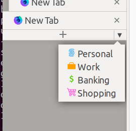

# webextensions-lib-menu-ui

[](https://travis-ci.org/piroor/webextensions-lib-menu-ui)

Helps to provide menu like UI.

The menu will behave similar to a native menu UI for major operations via the pointing device and the keyboard).

## Screenshots





## Usage

Load the file `MenuUI.js` from any visible document (sidebar panel or browser action panel), like:

```html
<script type="application/javascript" src="./MenuUI.js"></script>
```

And define hierarchical menu based on `ul`-`li` list, like:

```html
<ul id="menu">
  <li>&amp;Save</li>
  <li>Co&amp;py
    <ul>
      <li>&amp;Title</li>
      <li>&amp;URL</li>
      <li>&amp;Metadata
        <ul>
          <li>&amp;Author</li>
          <li>&amp;Email</li>
        </ul>
      </li>
    </ul>
  </li>
  <li class="separator"></li>
  <li>&amp;Close</li>
</ul>
```

Then, create an instance of `MenuUI` with required parameters like:

```javascript
var menuUI = new MenuUI({
  root:      document.getElementById('menu'),
  onCommand: (aItem, aEvent) => {
    // handle click event on an item
  }
});
```

Now you can open/close menu-like UI by its instance method:

```javascript
window.addEventListener('contextmenu', aEvent => {
  aEvent.stopPropagation();
  aEvent.preventDefault();
  // open custom menu instead of native context menu
  menuUI.open({
    left: aEvent.clientX,
    top:  aEvent.clientY
  });
});
```


### Parameters for the constructor

Here is the list of parameters for the `MenuUI` constructor:

 * `root` (required): The top-level list to become a menu. (`Element`)
 * `onCommand` (required): The handler for click event on a menu item. (`Function`)
 * `onShown` (optional): The handler called when the menu is shown (opened). (`Function`)
 * `onHidden` (optional): The handler called when the menu is hidden (closed). (`Function`)
 * `appearance` (optional): The visual style of the menu. (`String`, default is `menu`.) Possible values:
   - `menu`: similar to native menu UI.
   - `panel`: similar to popup panel UI.
 * `animationDuration` (optional): The duration of the animation of fade-in-out effect, in milliseconds. (`Integer`, default value is `150`.)
 * `subMenuOpenDelay` (optional): The delay when a submenu is opened after its parent item is pointed, in milliseconds. (`Integer`, default value is `300`.)
 * `subMenuCloseDelay` (optional): The delay when a submenu is closed after foreign item is pointed, in milliseconds. (`Integer`, default value is `300`.)


## Features of instances

### How to open the menu

The instance method `open()` opens the menu. You can specify the position of the opened menu in two ways:

#### Open the menu at specified position

Specifying corrdinates via `left` and `top` will show the menu near given coordinates. Typically this form is useful to open menu based on mouse events, like:

```javascript
window.addEventListener('click', aEvent => {
  menuUI.open({
    left: aEvent.clientX,
    top:  aEvent.clientY
  });
});
```

#### Open the menu near specified anchor element

Specifying an element via `anchor` will show the menu near the element. Typically this form is useful to open menu as a dropdown or popup, like:

```javascript
const button = document.getElementById('button');
button.addEventListener('click', () => {
  menuUI.open({
    anchor: button
  });
});
```

#### Canceller for `open()` method

The `open()` instance method accepts one more optional parameter, `canceller`. It is a function returning boolean value, and the opening operation of the menu will be canceled if the function returns `false`. For example:

```javascript
let canceled = false;

button.addEventListener('click', () => {
  menuUI.open({
    left: aEvent.clientX,
    top:  aEvent.clientY,
    canceller: () => {
      return canceled;
    }
  });
});

button.addEventListener('dblclick', () => {
  canceled = true;
  menuUI.close();
});
```

On this case, if you double-click the button, the menu won't be shown.

### How to close the menu

Calling an instance method `close()` will close the opened menu. This method will close all submenus also.

### How to know the menu is opened or not

There is an instance property `opened`. It returns a boolean value and `true` means "opened", `false` means "closed".

### How to run command by menu selection

A function specified via the `onCommand` parameter for the constructor will be called when a menu item without submenu is triggered. The function will receive the triggered menu item as its first argument. The second argument is the raw DOM event. Then you can do anything for the item.

```javascript
var menuUI = new MenuUI({
  root:      document.getElementById('menu'),
  onCommand: (aItem, aEvent) => {
    switch (aItem.id) {
      case 'command1':
        doCommand1();
        break;

      case 'command2':
        doCommand2();
        break;

      default:
        doGenericCommand(aItem.dataset.value);
        break;
    }
    menuUI.close();
  }
});
```

Note that the menu is not closed automatically by clicking on a menu item. You need to close the menu itself manually after doing something.

### Menu separator

Blank `<li>` elements with a class `separator` are treated as menu separator.

### Accesskeys for keyboard operations

If the label of a menu item contains a part `&` (`&amp;` in HTML) followed by an non-whitespace character (like `&A`), the character following to the `&` will be treated as the accesskey of the item.

